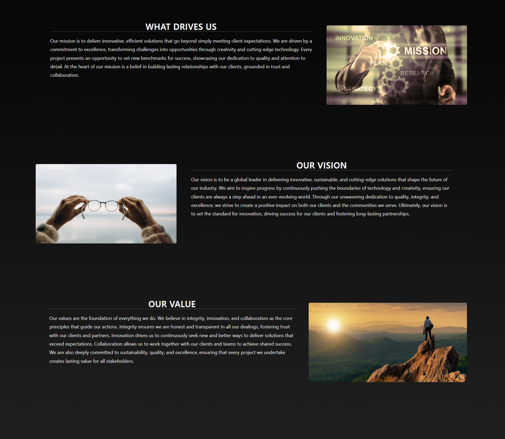
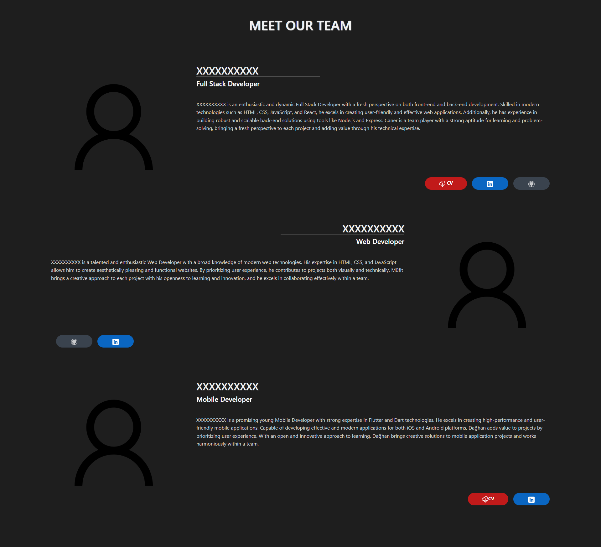
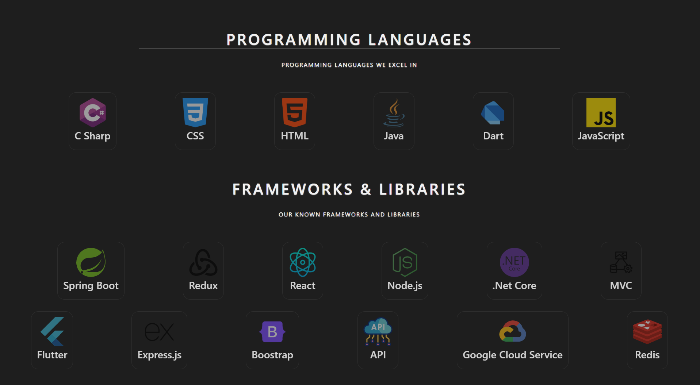
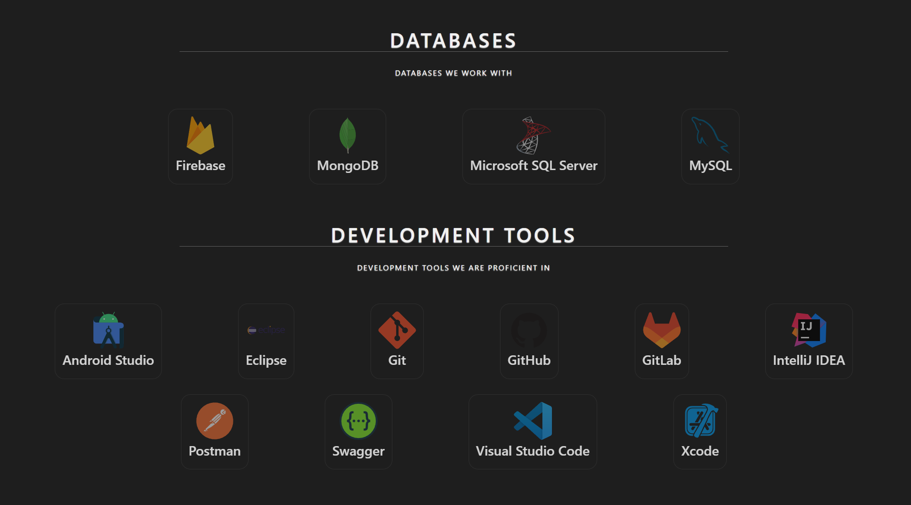
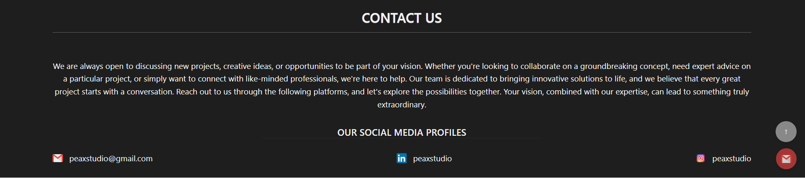

# 🎨 PeaxStudio

**PeaxStudio** is a responsive single-page portfolio website designed for showcasing a company’s identity, team, and services.  
The project features smooth navigation, team introductions, tech stack highlights, contact details, and a built-in email sending form.

This site is fully functional and deployed on **Heroku** *(no active link currently available)*.
 
---

## 🚀 Features

- 🖥️ **Single-page application** with smooth button-based navigation
- 👨‍💼 **Company introduction** and **team member details**
- 🧰 Showcase of **technologies used**
- 📞 **Contact information** and **email form**
- 📷 Rich design with multiple sections and UI elements
- 🌐 Fully responsive and visually modern layout

---

## 🛠️ Tech Stack

| Layer         | Technologies                            |
|---------------|-----------------------------------------|
| Frontend      | React.js, JavaScript, CSS               |
| Backend       | Node.js, Express.js                     |
| Email Service | Nodemailer                              |
| Deployment    | Heroku                                  |
| Tools         | Postman, Git, GitHub, VS Code           |

---

## 📷 Screenshots













---

## 📦 Getting Started

Clone the repository:

```bash
git clone https://github.com/kuyucucaner/peaxstudio.git
cd peaxstudio
cd backend / npm install
cd frontend /npm install
npm install

---
## 🛡️ Environment Variables

PORT=5000
MAIL_ID:your_mail_id
MAIL_PASSWORD:your_mail_password

---
## ▶️ Run the App
 npm start 
